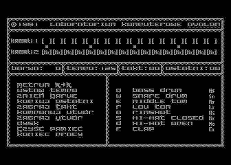

# Automat Perkusyjny

This directory contains source of Automat Perkusyjny (software drum machine), developed by  Maciej Miąsik and published by LK Avalon in 1991.

## Source files

Original program:

* [d2/APLOAD.ASM](d2/APLOAD.ASM) - loading screen used by both versions,
* [d2/AP.ASM](d2/AP.ASM) - disk version's pattern editor, song controls, and drum playback,
* [d2/AP2.ASM](d2/AP2.ASM) - disk directory, file loading, and saving; included by `AP.ASM`,
* [d1/CAP.ASM](d1/CAP.ASM) - cassette version's pattern editor, song controls, and drum playback,
* [d1/CAP2.ASM](d1/CAP2.ASM) - cassette loading and saving; included by `CAP.ASM`.

MADS files linking the objects and resources into executables:

* [main.asm](main.asm) - builds the disk version, `bin/ap.xex`,
* [main-cassette.asm](main-cassette.asm) - builds the cassette version, `bin/cap.xex`.

## Resources

* [Review in Tajemnice Atari](http://tajemnice.atari8.info/4_91/4_91_automat.html)
* [Manual](https://web.archive.org/web/20211017101501/http://atarionline.pl/biblioteka/materialy_o_uzytkach/Automat%20Perkusyjny.djvu)
