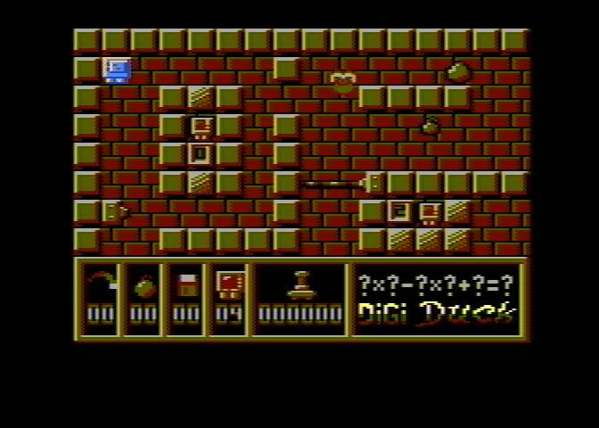

# Digi Duck

This directory contains the source code of the 8-bit Atari game Digi Duck, created by Dariusz Żołna in 1993 and published by LK Avalon.

## Source files

Original program:

* [DUCK.ASM](src/DUCK.ASM) - main executable,
* [DD_PROC.ASM](src/DD_PROC.ASM) - procedures,
* [DATAS.ASM](src/DATAS.ASM) - constants and code data,
* [INIT.ASM](src/INIT.ASM) - initializer,

Binary files:

* [INIT.FNT](src/INIT.FNT) - (`$1C00-1DDF`),
* [DIGI.DTA](src/DIGI.DTA) - (`$2200-46B2`),
* [DIGI.CMC](src/DIGI.CMC) - (`$8300-8F51`),
* [DIGI.PLR](src/DIGI.PLR) - (`$AC00-B3FF`),
* [DIGI.FNT](src/DIGI.FNT) - (`$B400-BBFF`),
* [DUCK.FNT](src/DUCK.FNT) - (`$A800-ABFF`),
* [LITERY.FNT](src/LITERY.FNT) - (`$6C00-6FFF`),
* [TITLE.FNT](src/TITLE.FNT) - (`$7000-77FF`),
* [DIGI.REP](src/DIGI.REP) - (`$7B00-82C1`),
* [SP.OBJ](src/SP.OBJ) - (`$8F80-9603, $99CC-99DB`),

MADS file linking all the objects and producing executables:

* [main.asm](main.asm)
