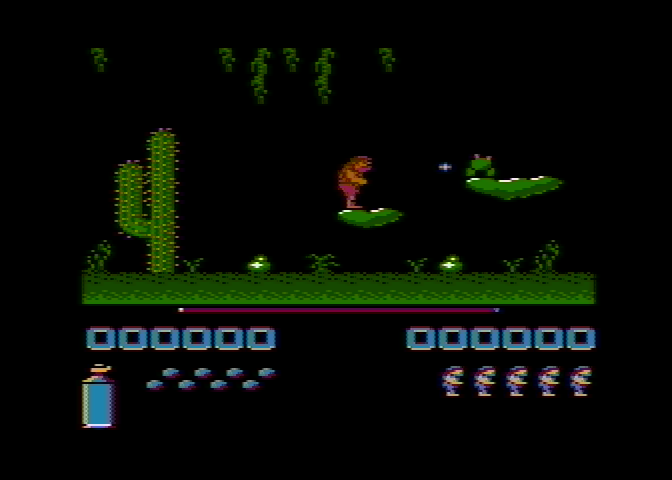

# Fred



This repository contains the source code of the 8-bit Atari game Fred, created by Mirosław Liminowicz in 1990 and published by LK Avalon.

## Source files

Original program:

* [d1/COMMON.ASM](d1/COMMON.ASM) - common labels,
* game implementation:
  * [d1/CI.ASM](d1/CI.ASM) and its newer version [d2/CI.ASM](d2/CI.ASM),
  * [d1/FR.ASM](d1/FR.ASM),
  * [d1/GR.ASM](d1/GR.ASM),
* [d1/SO.ASM](d1/SO.ASM) - sounds,
* [d1/TI.ASM](d1/TI.ASM) - title screen,
* [d2/AMP.ASM](d1/AMP.ASM) - music player,
* [d1/SHOWPIC.ASM](d1/SHOWPIC.ASM) - optional loader picture display,

Saver:

* [d1/FRED.DOC](d1/FRED.DOC) - original linking instructions,
* [d1/MAKEFRED.ASM](d1/MAKEFRED.ASM) - prepares executable,
* [d1/CSAV.ASM](d1/CSAV.ASM) - casette saver,
* [d1/DSAV.ASM](d1/DSAV.ASM) - disk saver.

Binary files:

* [d2/DI.FNT](d2/DI.FNT) - info font (`$4800`),
* [d2/FAZY.FNT](d2/FAZY.FNT) - phases font (`$5000`),
* [d2/FRED.AMC](d2/FRED.AMC) - song (`$8B00`),
* [d2/FRED.PIC](d2/FRED.PIC) - loader picture (`$A010`),
* [d2/GRA.DTA](d2/GRA.DTA) - level data (`$6100`)
* [d2/GRA.FNT](d2/GRA.FNT) - (`$5800`),
* [d2/GRA.PLR](d2/GRA.PLR) - player font (`$4000`),
* [d2/GRA.STA](d2/GRA.STA) - (`$60C0`),
* [d2/TITLE.FNT](d2/TITLE.FNT) - title screen font (`$3800`).

MADS file linking all the objects and producing executables:

* [main.asm](main.asm)

## Compilation

### Requirements

* MADS assembler

### Commands

```bash
mads main.asm -o:bin/fred.xex
```

Or with make:

```bash
make
```

Checksums can be validated with:
```bash
make test
```

## Record of applied changes

Sources were downloaded from the [Atari XL/XE Source Archive](http://sources.pigwa.net/), translated with [convert-atascii.go](../util/convert-atascii.go) and manually cleaned up.

Now the code can be compiled with [MADS](https://mads.atari8.info/) and the [checksums](checksum.md5) of the compiled modules match the ones from the [original archive](archive).
