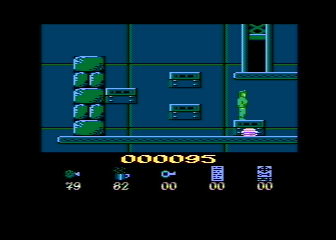

# Hans Kloss



This directory contains the source code of the 8-bit Atari game Hans Kloss, created by Dariusz �ołna in 1992 and published by LK Avalon.

## Source files

Original program:

* [side\_a/HK\_INIT.ASM](side_a/HK_INIT.ASM) - initializer,
* [side\_a/HK\_LOAD.ASM](side_a/HK_LOAD.ASM) - loader,
* [side\_a/HK\_MAIN.ASM](side_a/HK_MAIN.ASM) - 1st part of the executable,
* [side\_a/HK\_PROC.ASM](side_a/HK_PROC.ASM) - 2nd part of the exeuctable,
* [side\_a/HK\_PLAY.ASM](side_a/HK_PLAY.ASM) - music player,
* [side\_a/PROTECT.ASM](side_a/PROTECT.ASM) - encryption tool for HK\_MAIN,

Binary files:

* [side\_a/HK\_LOAD.FNT](side_a/HK_LOAD.FNT) - (`$B800-BBFF`),
* [side\_a/HK\_MAIN.FNT](side_a/HK_MAIN.FNT) - (`$8000-87FF`),
* [side\_a/HK\_TITL.FNT](side_a/HK_TITL.FNT) - (`$5C00-63FF`),
* [side\_a/HK\_FINI.FNT](side_a/HK_FINI.FNT) - (`$5400-5BFF`),
* [side\_a/HK\_GOTH.FNT](side_a/HK_GOTH.FNT) - (`$5000-53FF`),
* [side\_a/HK\_PLAN.FNT](side_a/HK_PLAN.FNT) - (`$4C00-4FFF`),
* [side\_a/HK\_NAME.FNT](side_a/HK_NAME.FNT) - (`$4800-4BFF`),
* [side\_a/HK\_WALK.PLR](side_a/HK_WALK.PLR) - (`$6400-6BFF`),
* [side\_a/HK\_JUMP.PLR](side_a/HK_JUMP.PLR) - (`$6C00-73FF`),
* [side\_a/HK\_STAT.STA](side_a/HK_STAT.STA) - (`$8800-883F`),
* [side\_a/HK\_PLAY.AMC](side_a/HK_PLAY.AMC) - song (`$3C00-428D`),
* [side\_a/HK\_CAVE.DTA](side_a/HK_CAVE.DTA) - (`$8900-B12C`),


MADS file linking all the objects and producing executables:

* [main.asm](main.asm)

## Code protection

The game executable is encrypted, by processing all bytes between:
```
Written by:D.Zolna
```
and
```
D.Zolna is De Jet
```
and XOR-ing them with `17`. On Atari it's done by the [side\_a/PROTECT.ASM](side_a/PROTECT.ASM) tool. To run the same kind of encoding on PC, the Makefile calls [protect.go](util/protect.go).

