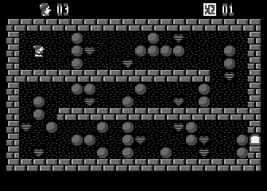

# Heartlight

This directory contains Janusz Pelc's Heartlight source.

## Original game files

* [d1/HL.ASM](d1/HL.ASM) - 6502 game code, including the title screen, cave logic, graphics, and sound.
* [d1/HL.BAS](d1/HL.BAS) - tokenized Atari BASIC loader with the palette, caves, and machine-code DATA lines.
* [d1/HL.LST](d1/HL.LST) - readable ASCII listing of `HL.BAS`; the build reads its palette and cave data.
* [d1/HL.FNT](d1/HL.FNT) - loadable character set at `$9000–$93FF`.
* [d1/HL.DTA](d1/HL.DTA) - archived raw image combining the needed font bytes and assembled game code.

## Original build tools

* [d1/HLAPD.BAS](d1/HLAPD.BAS) - tokenized BASIC program that combines `HL.FNT` and `HL.OBJ` into `HL.DTA`.
* [d1/HLAPD.LST](d1/HLAPD.LST) - ASCII listing of `HLAPD.BAS`.
* [d1/HLCONV.BAS](d1/HLCONV.BAS) - tokenized BASIC program that converts `HL.DTA` to hexadecimal DATA lines.
* [d1/HLCONV.LST](d1/HLCONV.LST) - readable ASCII listing of the converter.
* [d1/HLREAD.ASM](d1/HLREAD.ASM) - BASIC-callable routines for copying cave rows and decoding hexadecimal DATA.
* [d1/HLREAD.BAS](d1/HLREAD.BAS) - tokenized BASIC program that prints memory bytes as decimal DATA lines.
* [d1/HLREAD.LST](d1/HLREAD.LST) - ASCII listing of `HLREAD.BAS`.
* [d1/HLMAKE.DOC](d1/HLMAKE.DOC) - original Polish instructions for assembling the files and preparing `HL.BAS`.

## Disk 2 editor assets

These files appear to belong to the Game Graph Editor included in the original archive. The Heartlight build does not use them.

* [d2/GAME.FNT](d2/GAME.FNT) - 2 KB character set loaded at `$4C00–$53FF`.
* [d2/GAME.DTA](d2/GAME.DTA) - 61-byte data segment loaded at `$5400–$543C`.
* [d2/GAME.STA](d2/GAME.STA) - 64-byte zero-filled segment loaded at `$3FC0–$3FFF`.

## Current build and reference files

* [main.asm](main.asm) - MADS linker source for the standalone Heartlight XEX.
* [Makefile](Makefile) - build, verification, and clean commands; run `make test` to check the result.
* [util/build-caves.py](util/build-caves.py) - converts palette and cave DATA from `HL.LST` into a loadable object.
* [util/detokenize-basic.py](util/detokenize-basic.py) - converts the original tokenized `.BAS` files into ASCII listings.
* [util/check-game.py](util/check-game.py) - checks the built XEX against the archived font/code image, cave settings, and start address.
* [reference/HL.OBJ](reference/HL.OBJ) - original assembled game object used for byte comparison.
* [reference/HLREAD.OBJ](reference/HLREAD.OBJ) - original assembled loader helper used for byte comparison.
* [checksum.md5](checksum.md5) - recorded checksums of the assembled objects.
* [archive/heartlight.zip](archive/heartlight.zip) - unchanged original source archive.

The build produces these tracked files:

* [bin/CAVES.OBJ](bin/CAVES.OBJ) - palette and cave data compiled from `HL.LST`.
* [bin/HL.OBJ](bin/HL.OBJ) - game code assembled from `HL.ASM`.
* [bin/HLREAD.OBJ](bin/HLREAD.OBJ) - loader helper assembled from `HLREAD.ASM` for comparison.
* [bin/heartlight.xex](bin/heartlight.xex) - standalone executable with font, game code, cave data, and start address.

The [screenshot](img/heartlight.png) is displayed above.
