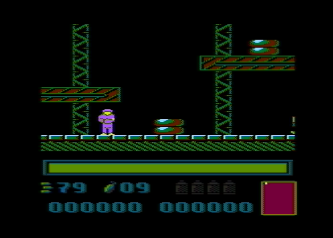

# Misja

This directory contains the source code of the 8-bit Atari game Misja, created by Janusz Pelc in 1990 and published by LK Avalon.

## Source files

Original program:

* [d1/JOINT.ASM](d1/JOINT.ASM) - common labels,
* [d1/E.ASM](d1/E.ASM) - enemies,
* [d1/I.ASM](d1/I.ASM) - player,
* [d1/M.ASM](d1/M.ASM) - main loop,
* [d1/S.ASM](d1/S.ASM) - sound,
* [d1/SCREEN.ASM](d1/SCREEN.ASM) - display list,
* [d1/T.ASM](d1/T.ASM) - title screen,
* [d1/W.ASM](d1/W.ASM) - weapon,
* [d2/AMP.ASM](d1/AMP.ASM) - music player,
* [d2/CSAV.ASM](d1/CSAV.ASM) - casette saver.

Binary files:

* [d2/ENEMY.FNT](d2/ENEMY.FNT) - enemies font (`$4000`),
* [d2/HERO.PLR](d2/HERO.PLR) - player font (`$6000`),
* [d2/INFO.FNT](d2/INFO.FNT) - text font (`$4800`),
* [d2/LEVEL1.DTA](d2/LEVEL1.DTA) - level data (`$1240`),
* [d2/LEVEL1.FNT](d2/LEVEL1.FNT) - font (`$5000`),
* [d2/LEVEL1.STA](d2/LEVEL1.STA) - stat (`$1200`),
* [d2/MISSION.AMC](d2/MISSION.AMC) - song (`$0A00`),
* [d2/TITLE.FNT](d2/TITLE.FNT) - title font (`$5800`).

MADS file linking all the objects and producing executables:

* [main.asm](main.asm)
