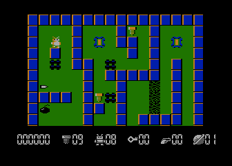

# Robbo



This repository contains the source code of the 8-bit Atari game Robbo, created by Janusz Pelc in 1989 and published by LK Avalon.

## Source files

Original program:

* [d1/R1.ASM](d1/R1.ASM) - main implementation, including also [R2.ASM](d1/R2.ASM),
* [d1/TITLE.ASM](d1/TITLE.ASM) - title screen,
* [d1/RS.ASM](d1/RS.ASM) - saver utility,

Levels in `txt` format can be compiled by [level-parser.go](util/level-parser.go). Original ASM files can't be browsed in Github, because of the untranslated ATASCII characters:

* d2/C1: [txt](d2/C1.txt) / [ASM](d2/C1.ASM)
* d2/C2: [txt](d2/C2.txt) / [ASM](d2/C2.ASM)
* d2/C3: [txt](d2/C3.txt) / [ASM](d2/C3.ASM)
* d2/DEMOL: [txt](d2/DEMOL.txt) / [ASM](d2/DEMOL.ASM)

MADS files linking all the objects and producing executables:

* [main.asm](main.asm)
* [demo.asm](demo.asm)
* [saver.asm](saver.asm)

## Compilation

### Requirements

* MADS assembler
* optionally, for building maps:
  * make
  * golang

### Commands

```bash
mads main.asm -o:bin/robbo.xex
```

Or with make:

```bash
make
```

Checksums can be validated with:
```bash
make test
```

## Record of applied changes

Sources were downloaded from the [Atari XL/XE Source Archive](http://sources.pigwa.net/) and then stripped of the ATASCII characters, so they can be read and edited in ASCII editors. In particular:

* sources were translated with [convert-atascii.go](../util/convert-atascii.go) and manually cleaned up,
* for the levels, I introduced a custom text format, visually similar to ATASCII
  * it can be compiled with [level-parser.go](util/level-parser.go),
  * original ASM files are available too and can be compiled with MADS,
  * replacing ATASCII characters in `dta c''` with `dta b()` is not practical, as it'd make the design unreadable.

Now the code can be compiled with [MADS](https://mads.atari8.info/) and the [checksums](checksum.md5) of the compiled modules match the ones from the [original archive](archive).
