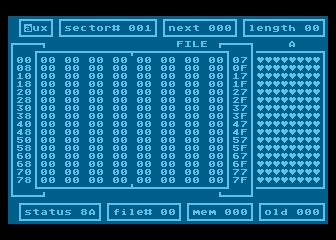
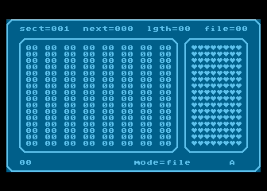

# Watson

This directory contains the source code of the disk editor utility program for 8-bit Atari called Watson, written by JBW.

There were multiple versions of Watson in the history. This archive contains some variants of the original Watson and Wacio.

## Watson

* [src/WATSON.ASM](src/WATSON.ASM) - main disk monitor: screen, sector I/O, keyboard handling, and hex/character editing,
* [src/NEW.ASM](src/NEW.ASM) - auxiliary menu and tools, including search, disk map, and drive selection,
* [src/DEC.ASM](src/DEC.ASM) - hex/decimal conversion dialog, included by `NEW.ASM`,
* [src/NEW2.ASM](src/NEW2.ASM) - window, text, and keyboard helpers, included by `NEW.ASM`.

More info: https://www.t2e.pl/article/watson-961

## Wacio (small Watson)

* [src/WATSON2.ASM](src/WATSON2.ASM) - main disk monitor: display, sector I/O, editors, and keyboard handling,
* [src/AUX2.ASM](src/AUX2.ASM) - auxiliary menu, search, disk map, drive selection, and error dialogs,
* [src/WGEM.ASM](src/WGEM.ASM) - window drawing, text printing, and screen-positioning routines.

More info: https://tajemnice.atari8.info/4_91/4_91_wacio.html

## MADS build files

* [main-watson.asm](main-watson.asm) - links the Watson objects and sets its startup vector,
* [main-wacio.asm](main-wacio.asm) - links the Wacio objects and sets its startup vector.
